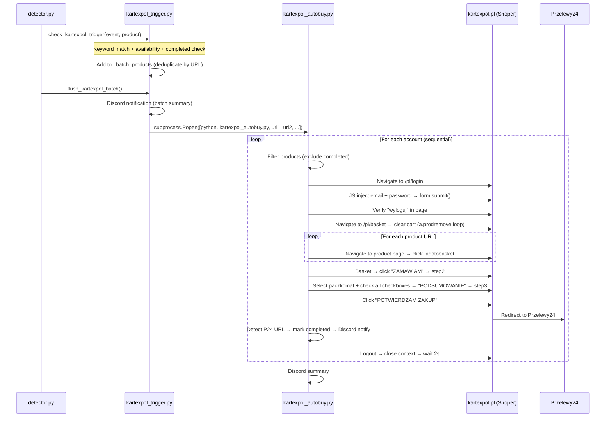
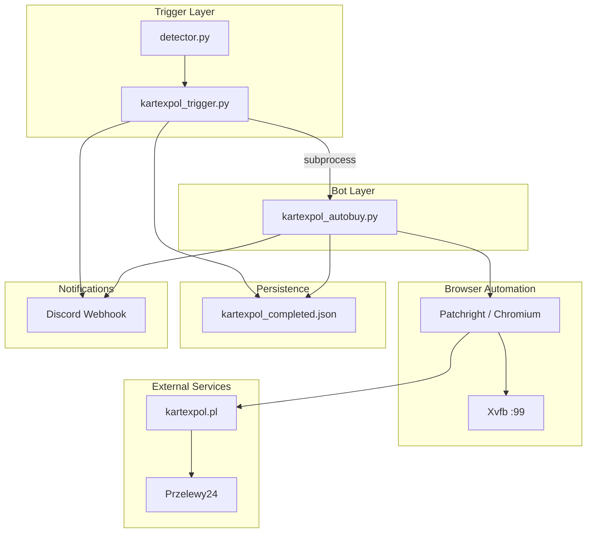

# Technical Design: Kartexpol Login + PayU (Przelewy24)

## Overview

This design covers the complete rewrite of the Kartexpol auto-buy bot from a guest-checkout aiohttp API approach to a login-based Patchright browser automation approach with Przelewy24/BLIK payment redirect. The architecture mirrors the proven Strefa-TCG auto-buy bot (`strefatcg_autobuy.py`) since both sites run on the same Shoper e-commerce platform with nearly identical HTML structures.

### Key Design Decisions

| Decision | Rationale |
|----------|-----------|
| Patchright (headless=False) over aiohttp API | Shoper platform blocks API-level cart operations for logged-in users; body overlays prevent standard Playwright interactions |
| JavaScript-based form injection | Shoper's cookie consent and body overlays intercept normal PW `click()` and `fill()` — JS bypasses these |
| Sequential account processing | Avoids rate limiting; each account needs isolated browser context to avoid session leakage |
| Batch mode (single bot invocation) | Matches the Strefa-TCG pattern; reduces process overhead; allows all matching products in one cart |
| JSON-based completed tracking | Simple, file-based persistence; no database dependency; matches existing pattern |
| Xvfb DISPLAY=:99 | Required for headless=False on VPS without physical display |

### Scope of Changes

1. **`kartexpol_autobuy.py`** — Complete rewrite (replace ~90 lines of aiohttp code with ~300 lines of Patchright browser automation)
2. **`kartexpol_trigger.py`** — Rewrite to match `strefatcg_trigger.py` batch pattern (replace ~20 lines with ~100 lines)
3. **`detector.py`** — Minor update: replace `check_kartexpol_autobuy` / `fire_kartexpol_buy` imports with new `check_kartexpol_trigger` / `flush_kartexpol_batch` pattern

## Architecture

### High-Level Flow



### Component Architecture



## Components and Interfaces

### 1. `kartexpol_trigger.py` — Trigger Module

Integrated into `detector.py` to collect matching products during a scan cycle and flush them to the bot.

#### Public API

```python
def check_kartexpol_trigger(event_type: str, product: dict) -> None:
    """
    Called from detector.py on each product event.
    Evaluates if product matches 30th keywords for kartexpol shop.
    If match: adds to internal _batch_products list (deduplicated by URL).
    
    Args:
        event_type: One of "NEW_PRODUCT", "RESTOCK", "PRICE_CHANGE"
        product: Dict with keys: shop, name, id, url, available, price
    """

def flush_kartexpol_batch() -> None:
    """
    Called at end of detect_and_send().
    If _batch_products is non-empty:
      1. Sends Discord notification with product list
      2. Launches kartexpol_autobuy.py subprocess with all URLs
      3. Clears the batch
    """
```

#### Internal Functions

```python
KEYWORDS_30TH = ["30th", "30 celebration", "30-lecie", "30 lecie", "30 rocznica"]
ALL_ACCOUNTS = [
    "esemento@gmail.com",
    "blackmat36@gmail.com", 
    "tjbtaniojuzbylo@gmail.com",
    "y24015411@gmail.com",
]

def _matches_keywords(name: str) -> bool:
    """Case-insensitive substring match against KEYWORDS_30TH."""

def _is_all_completed(product_id: str) -> bool:
    """Returns True if all 4 accounts already bought this product."""

def _load_completed() -> dict:
    """Load kartexpol_completed.json; return {} if missing or malformed."""
```

#### Subprocess Launch

```python
cmd = [
    "/opt/pokemon-monitor-v2/venv/bin/python3", "-u",
    str(BOT_PATH),
    "--accounts", "4",
    "--qty", "1",
] + urls  # Product URLs as positional args

env = {**os.environ, "DISPLAY": ":99"}

subprocess.Popen(
    cmd,
    env=env,
    stdout=open("/opt/pokemon-monitor-v2/kartexpol_autobuy_stdout.log", "a"),
    stderr=open("/opt/pokemon-monitor-v2/kartexpol_autobuy_stderr.log", "a"),
    cwd="/opt/pokemon-monitor-v2"
)
```

---

### 2. `kartexpol_autobuy.py` — Auto-Buy Bot

The main bot script. Processes accounts sequentially in isolated browser contexts.

#### CLI Interface

```
usage: kartexpol_autobuy.py [-h] [--test] [--accounts N] [--start N] [--qty N] url [url ...]

positional arguments:
  url           One or more product URLs to purchase

optional arguments:
  --test        Use test account (t11008543@gmail.com) instead of production accounts
  --accounts N  Process only first N accounts (1-4, default: 4)
  --start N     Start from account number N (1-indexed, 1-4, default: 1)
  --qty N       Quantity per product per account (1-10, default: 1)
```

#### Core Functions

```python
async def dismiss_overlay(page) -> None:
    """Remove cookie consent overlays and restore pointer-events on body."""

async def login(page, email: str, password: str) -> bool:
    """
    Login to kartexpol.pl via JS form injection.
    Returns True if "wyloguj" detected in page after submission.
    Retries up to 3 times with 3-second waits between attempts.
    """

async def clear_cart(page) -> None:
    """
    Navigate to /pl/basket and remove items by following a.prodremove hrefs.
    Loops up to 20 times until no items remain.
    """

async def add_to_cart(page, product_url: str) -> bool:
    """
    Navigate to product page and click .addtobasket via JS.
    Returns True on success, False if button not found/disabled.
    """

async def checkout(page, test_mode: bool = False) -> bool:
    """
    Complete 3-step checkout:
      1. Basket → click ZAMAWIAM → verify step2 URL
      2. Step2 → select paczkomat radio, check all checkboxes → PODSUMOWANIE → verify step3 URL
      3. Step3 → click POTWIERDZAM ZAKUP → verify przelewy24 redirect
    Returns True if Przelewy24 payment page reached.
    """

async def logout(page) -> None:
    """Navigate to /pl/logout."""

async def run_for_account_batch(page, account: dict, product_urls: list, test_mode: bool = False) -> str:
    """
    Full buy flow for one account:
      1. Filter products (exclude completed)
      2. Login
      3. Clear cart
      4. Add all products to cart
      5. Checkout
      6. Mark completed + Discord notify
    Returns: "success", "skipped", "login_failed", "atc_failed", "checkout_failed"
    """

async def main() -> None:
    """
    Entry point:
      1. Parse CLI args
      2. Validate environment (DISPLAY=:99)
      3. Launch Patchright browser
      4. Process accounts sequentially in separate contexts
      5. Send Discord summary
    """
```

#### Account Configuration

```python
BASE_URL = "https://www.kartexpol.pl"
BOT_DIR = Path("/opt/pokemon-monitor-v2")
COMPLETED_FILE = BOT_DIR / "kartexpol_completed.json"
LOG_FILE = BOT_DIR / "kartexpol_autobuy.log"
WEBHOOK_FILE = BOT_DIR / "discord_webhook_kartexpol.txt"

ACCOUNTS = [
    {"email": "esemento@gmail.com", "password": "<registered_password>", "name": "Tomasz Szczepaniak"},
    {"email": "blackmat36@gmail.com", "password": "<registered_password>", "name": "Natalia Szczepaniak"},
    {"email": "tjbtaniojuzbylo@gmail.com", "password": "<registered_password>", "name": "Jagoda Kaczmarek"},
    {"email": "y24015411@gmail.com", "password": "<registered_password>", "name": "Mirosława Szczepaniak"},
]

TEST_ACCOUNT = {"email": "t11008543@gmail.com", "password": "<registered_password>", "name": "Marian Wasilewski"}
```

---

### 3. Completed Tracker Module (embedded in both files)

Shared logic for reading/writing `kartexpol_completed.json`.

```python
def load_completed() -> dict:
    """Load JSON file. Return {} if missing or malformed JSON."""

def save_completed(data: dict) -> None:
    """Write dict to JSON file with indent=2."""

def is_completed(product_id: str, email: str) -> bool:
    """Check if email is in completed[product_id] list."""

def mark_completed(product_id: str, email: str) -> None:
    """Add email to completed[product_id] list and save."""
```

---

### 4. Discord Notification Module (embedded)

```python
async def send_discord(message: str) -> None:
    """
    Read webhook URL from WEBHOOK_FILE.
    POST {"content": message} with 10-second timeout.
    Log warning and continue on any failure.
    """
```

## Data Models

### `kartexpol_completed.json`

```json
{
  "12345": ["esemento@gmail.com", "blackmat36@gmail.com"],
  "67890": ["esemento@gmail.com", "blackmat36@gmail.com", "tjbtaniojuzbylo@gmail.com", "y24015411@gmail.com"]
}
```

- **Keys**: Product IDs (string) — extracted from URL path (last numeric segment)
- **Values**: Arrays of email addresses that have successfully completed purchase
- **Created**: Automatically on first `save_completed()` call if file doesn't exist
- **Concurrency**: Not a concern (single bot process, sequential accounts)

### Product Event (from detector)

```python
{
    "id": "kartexpol_12345",        # Prefixed product ID
    "shop": "kartexpol",             # Shop identifier
    "name": "Pokemon TCG 30th ...",  # Product display name
    "url": "https://www.kartexpol.pl/pl/p/Product-Name/12345",
    "available": True,               # Stock availability
    "price": "199.99 PLN",          # Display price
}
```

### Account Configuration (internal)

```python
{
    "email": "esemento@gmail.com",
    "password": "secure_password",
    "name": "Tomasz Szczepaniak"     # Display name for Discord/logging
}
```

### Batch Product Entry (trigger internal)

```python
{
    "url": "https://www.kartexpol.pl/pl/p/Product-Name/12345",
    "name": "Pokemon TCG 30th Anniversary...",
    "id": "12345",                   # Stripped product ID (no prefix)
    "price": "199.99 PLN"
}
```

### Bot Result States

| State | Meaning | Next Action |
|-------|---------|-------------|
| `"success"` | Order placed, P24 redirect detected | Mark completed, Discord notify |
| `"skipped"` | All products already completed for account | Skip (no login) |
| `"login_failed"` | 3 login attempts exhausted | Log, proceed to next account |
| `"atc_failed"` | Zero products added to cart | Logout, proceed to next account |
| `"checkout_failed"` | Checkout flow did not reach P24 | Logout, proceed to next account |

## Correctness Properties

*A property is a characteristic or behavior that should hold true across all valid executions of a system — essentially, a formal statement about what the system should do. Properties serve as the bridge between human-readable specifications and machine-verifiable correctness guarantees.*

### Property 1: Completed Tracker Round-Trip

*For any* product ID (non-empty string) and account email (valid email string), calling `mark_completed(product_id, email)` followed by `is_completed(product_id, email)` SHALL return `True`, and the data SHALL survive a `save_completed` → `load_completed` cycle without loss.

**Validates: Requirements 4.1, 4.2**

### Property 2: Completed Filtering Exclusion

*For any* set of product URLs and a completed tracker state, when filtering products for a given account email, the resulting list SHALL never contain a product whose ID is already marked as completed for that email. Furthermore, if ALL 4 configured account emails appear in a product's completed list, that product SHALL be excluded from the trigger batch entirely.

**Validates: Requirements 4.3, 4.5**

### Property 3: Trigger Keyword Matching

*For any* product event, the trigger SHALL add the product to the batch if and only if: (a) the product's shop field equals "kartexpol", AND (b) the product is marked available, AND (c) the product name contains at least one of the keywords ["30th", "30 celebration", "30-lecie", "30 lecie", "30 rocznica"] as a case-insensitive substring. For any product name that does NOT contain any of these keywords, the trigger SHALL NOT add it to the batch regardless of other conditions.

**Validates: Requirements 5.1, 5.2**

### Property 4: Batch URL Deduplication

*For any* sequence of matching product events processed during a single scan cycle, the batch collector SHALL contain at most one entry per unique product URL. If the same URL appears in multiple events, only the first occurrence SHALL be retained.

**Validates: Requirements 5.3**

### Property 5: Account Selection Logic

*For any* valid `--start S` (1 ≤ S ≤ 4) and `--accounts A` (1 ≤ A ≤ 4), the set of processed accounts SHALL equal `ACCOUNTS[S-1 : min(S-1+A, 4)]`. For any integer values of S or A outside the range 1–4, the bot SHALL exit with an error. When `--test` is provided, the processed accounts SHALL be exactly `[TEST_ACCOUNT]` regardless of other flags.

**Validates: Requirements 7.5, 7.6, 7.7, 7.8**

### Property 6: Login Retry Bound

*For any* sequence of login outcomes (success or failure) for an account, the bot SHALL attempt login at most 3 times. If any attempt succeeds, no further attempts SHALL be made. If all 3 attempts fail, the account SHALL be skipped (result = "login_failed").

**Validates: Requirements 1.3, 1.4**

## Error Handling

### Login Failures

| Condition | Handling |
|-----------|----------|
| Page navigation timeout (30s) | Count as failed attempt; retry (max 3) |
| Cookie overlay blocks form | `dismiss_overlay()` removes overlays before each attempt |
| "wyloguj" not found after submit (10s) | Count as failed attempt; wait 3s then retry |
| All 3 attempts fail | Log failure with email + reason; skip account; continue to next |
| Network error during login | Count as failed attempt; apply retry logic |

### Cart Operations

| Condition | Handling |
|-----------|----------|
| Product page fails to load | Log warning with URL; skip product; continue to next |
| `.addtobasket` button not found | Log warning; skip product; continue |
| Button found but disabled (out of stock) | Log warning; skip product; continue |
| Zero products added after all attempts | Set result = "atc_failed"; logout; proceed to next account |
| Cart clear loop exceeds 20 iterations | Stop clearing; proceed with current cart state |

### Checkout Failures

| Condition | Handling |
|-----------|----------|
| "ZAMAWIAM" not found on basket page | Log error with URL; logout; skip to next account |
| Step2 URL not reached within 10s | Log error; logout; skip to next account |
| Paczkomat radio not found | Log warning; continue (may fail at next step) |
| "PODSUMOWANIE" click doesn't advance to step3 | Log error; logout; skip to next account |
| "POTWIERDZAM ZAKUP" button not found | Log error; logout; skip to next account |
| Przelewy24 redirect not detected within 15s | Log error with final URL + page snippet; logout; skip to next account |

### Persistence Failures

| Condition | Handling |
|-----------|----------|
| `kartexpol_completed.json` doesn't exist | Create new file on first write; treat as empty on read |
| JSON parse error (malformed file) | Log warning; treat as empty (no completions); overwrite on next save |
| File write permission error | Log error; continue (product may be re-purchased on next cycle) |

### Discord Notification Failures

| Condition | Handling |
|-----------|----------|
| Webhook file missing | Log warning; skip notification; continue processing |
| Webhook file empty | Skip notification; continue |
| HTTP POST timeout (>10s) | Log warning; continue processing |
| HTTP POST error (4xx/5xx) | Log warning; continue processing |
| Network unreachable | Log warning; continue processing |

### Environment Failures

| Condition | Handling |
|-----------|----------|
| DISPLAY not set to `:99` | Print error message; exit with code 1 |
| Xvfb not running | Print error message; exit with code 1 |
| No product URLs provided | Print usage message; exit with code 1 |
| `--accounts` or `--start` outside 1–4 | Print error with valid range; exit with code 1 |
| Bot script file not found (trigger) | Log error; skip bot launch for this cycle |

## Testing Strategy

### Dual Testing Approach

This feature uses both **integration tests** (against the live Kartexpol site) and **property-based tests** (for pure logic modules). The majority of the bot's behavior involves browser automation against an external website, making integration tests the primary validation method. However, the pure logic components (completed tracking, keyword matching, batch deduplication, account selection) are well-suited to property-based testing.

### Integration Testing (Primary)

The bot's `--test` flag enables end-to-end validation against the live site using the dedicated test account (`t11008543@gmail.com`):

```bash
# Full flow test (login → clear cart → ATC → checkout → verify P24 redirect)
python3 kartexpol_autobuy.py --test https://www.kartexpol.pl/pl/p/Product-Name/12345

# Multi-product test
python3 kartexpol_autobuy.py --test --qty 1 URL1 URL2

# Account subset test
python3 kartexpol_autobuy.py --accounts 1 URL1
```

**What integration tests verify:**
- Login flow works (cookie dismissal, JS form filling, "wyloguj" detection)
- Cart clearing works (a.prodremove loop)
- Add-to-cart works (.addtobasket click)
- 3-step checkout advances correctly (step2 → step3 → P24 redirect)
- Browser context isolation between accounts

### Property-Based Testing

**Library**: [Hypothesis](https://hypothesis.readthedocs.io/) (Python PBT framework)

**Configuration**: Minimum 100 iterations per property test.

Each property test references its design document property via tag comment:

```python
# Feature: kartexpol-login-payu, Property 1: Completed Tracker Round-Trip
# Feature: kartexpol-login-payu, Property 2: Completed Filtering Exclusion
# Feature: kartexpol-login-payu, Property 3: Trigger Keyword Matching
# Feature: kartexpol-login-payu, Property 4: Batch URL Deduplication
# Feature: kartexpol-login-payu, Property 5: Account Selection Logic
# Feature: kartexpol-login-payu, Property 6: Login Retry Bound
```

**Property test implementation approach:**
- Extract pure functions into testable units (keyword matching, completed tracker, account selection)
- Use `hypothesis.strategies` to generate random product IDs, emails, product names, CLI args
- Use `tmp_path` fixture for completed JSON file I/O tests
- Mock browser/page objects for retry logic tests

### Unit Tests (Edge Cases)

- Empty product URL list → exit with usage message
- Malformed completed JSON → treated as empty
- Missing webhook file → no exception raised
- `--qty` outside 1–10 → error
- Product URL with no numeric suffix → graceful handling
- All products completed for account → skip without login attempt

### Test Organization

```
tests/
  test_kartexpol_properties.py    # Property-based tests (Hypothesis)
  test_kartexpol_unit.py          # Edge case unit tests
  # Integration testing done manually via --test flag against live site
```
